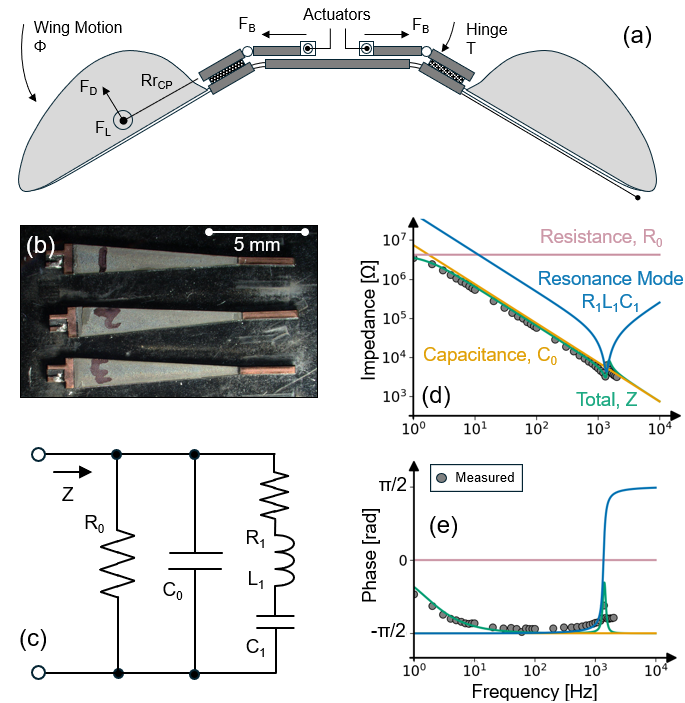
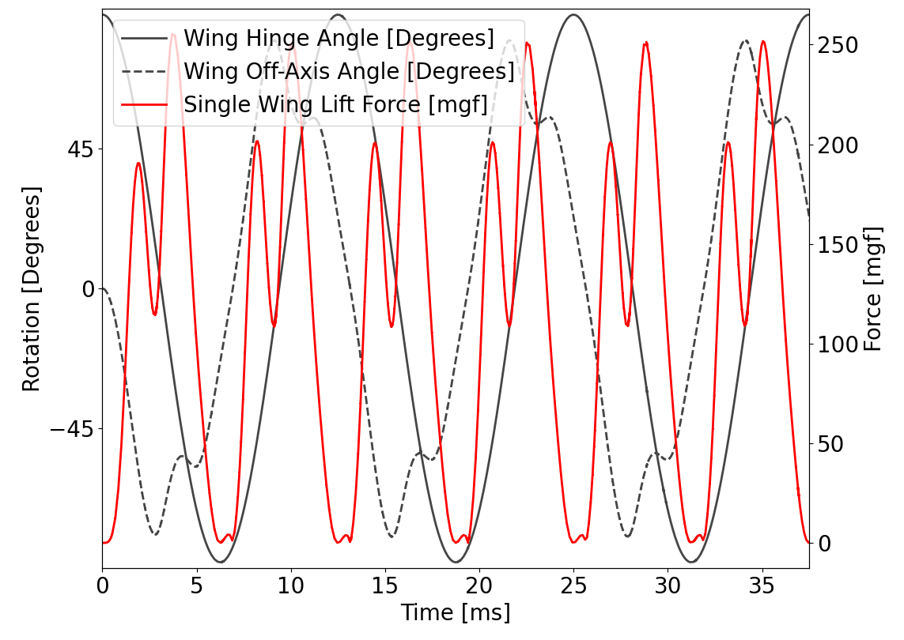
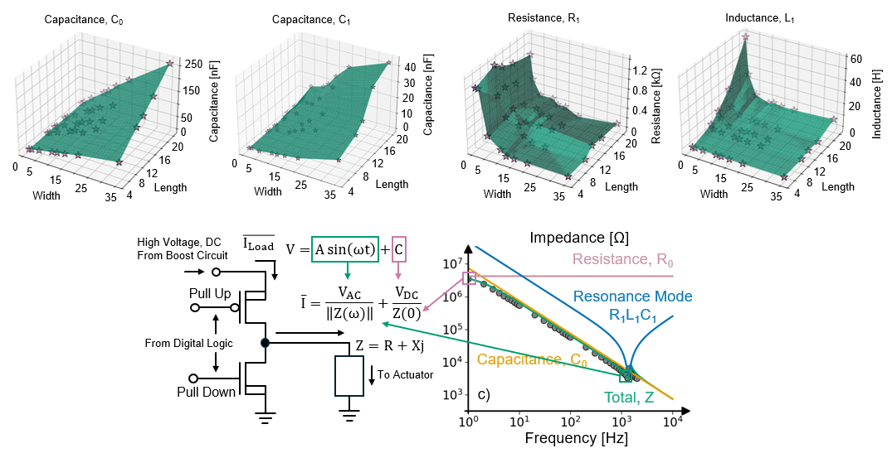

# Implementation of Actuation: Wings and PZT Bimorph Section

This document explains how the Python modules in `../raw/` implement the **Actuation: Wings and PZT Bimorph** section from the electromechanical co-design framework paper. The implementation spans three primary files:

1. **`piezo_bimorph.py`** — Implements the PZT bimorph actuator model
2. **`passive.py`** — Implements the wing aeromechanical system  
3. **`mechanical-options.py`** — Orchestrates design space exploration combining both models

---

## Overview: Architecture and Integration

The actuation subsystem couples two primary components, the PZT Bimorph and Wing which interact as shown:

<div align="center">
  
</div>

```
[Electric Field Input] 
         ↓
  [PZT Bimorph] ← Blocked force, tip displacement, impedance
         ↓
  [Transmission Ratio] ← Converts bimorph displacement to wing rotation
         ↓
  [Wing Dynamics] ← Aerodynamic forces, rotational inertia
         ↓
  [Lift Output]
```

The paper describes this coupling in Section **(iii) Actuation: Wings and PZT Bimorph**, which we implement in stages.

---

## Part (a): Wings Implementation (`passive.py`)

The paper's wing model implements the **blade element method** to compute aerodynamic forces and wing dynamics.

### Wing Geometry and Aerodynamic Parameters

```python
def __init__(this, R, frequency, transmission, amplitude, ...):
    this.R = R                      # Wing length (mm)
    this.frequency = frequency      # Flapping frequency (Hz)
    this.transmission = transmission # Transmission ratio T
    this.amplitude = amplitude      # Wing stroke amplitude (radians)
    this.ar = 3.5                   # Aspect ratio AR (constant)
    this.cbar = R / ar              # Chord length
```

These parameters directly correspond to Table 1 inputs in the paper:
- `R` — Wing length (Input parameter)
- `$\Phi$` (amplitude) — Wing stroke amplitude (Input parameter)
- `T` (transmission) — Wing hinge gear ratio (Input parameter)
- `$F$` (frequency) — Wing flapping frequency (Input parameter)

### Aerodynamic Forces: Lift and Drag

The paper derives thrust and drag using the blade element method:

$$F_X = \frac{1}{2}\rho_{AIR} C_X \dot{\Phi}^2 \beta$$

where $C_X$ is either $C_L$ (lift) or $C_D$ (drag), and $\beta = \frac{R^2}{AR}$ is the wing area.

The implementation models lift and drag coefficients as functions of wing orientation $\alpha$:

```python
def cl(this, alpha):
    return this.clmax * np.sin(2.0 * alpha)

def cd(this, alpha):
    return ((this.cdmax + this.cd0) / 2.0) - \
           ((this.cdmax - this.cd0) / 2.0) * np.cos(2.0 * alpha)
```

These directly implement the paper's equations:
- $C_L(\alpha) = C_{L_{MAX}} \sin(2\alpha)$  
- $C_D(\alpha) = \frac{C_{D_{MAX}} + C_{D_0}}{2} - \frac{C_{D_{MAX}} - C_{D_0}}{2}\cos(2\alpha)$

Wing area is computed as:
```python
this.beta = spin.quad(this.betafunc, 0.0, 1.0)[0]
```

This numerically integrates the wing shape parameter to obtain $\beta$, accounting for the wing's tapered geometry.

### Lift Calculation

The instantaneous lift is computed as:

```python
def Flift(this, wh, alpha):
    f = 0.5 * Wing.airdens * wh * wh * this.cl(alpha) * \
        this.cbar * this.R * this.R * this.R * this.Fhat
    return f
```

This implements $F_L = \frac{1}{2}\rho_{AIR} C_L \dot{\Phi}^2 \beta$, where:
- `wh` is the wing tip velocity magnitude $\dot{\Phi}$
- `this.Fhat` captures wing geometry contributions
- `Wing.airdens = 1.293e3` corresponds to $\rho_{AIR}$ in the paper

### Mechanical Dynamics: Lumped Element Model

The paper describes the wing-actuator system using a **lumped mechanical model**:

$$F_{ACTUATOR} = m\ddot{x} + b\dot{x} + kx$$

where $m$, $b$, and $k$ represent equivalent mass, damping, and spring constant. In `passive.py`, this is implemented in the `forward()` method as a second-order ODE:

```python
def forward(this, t, state):
    psi, psidot = state
    
    # Input: bimorph displacement converted to wing angle via transmission
    phi = this.transmission * this.amplitude * np.cos(2.0 * np.pi * this.frequency * t)
    phidot = -2.0 * np.pi * this.frequency * this.transmission * this.amplitude * \
             np.sin(2.0 * np.pi * this.frequency * t)
    
    # Compute wing velocity
    wx, wy, wz = this.wfunc(phi, phidot, psi, psidot)
    wh = np.sqrt(wy * wy + wz * wz)
    alpha = this.alphafunc(wy, wz)
    
    # Accumulate moments from three sources
    ma = this.mxaero(wh, alpha)      # Aerodynamic moment
    mr = this.mxrd(wx)               # Rotational damping moment
    me = this.mxelastic(psi)         # Spring moment
    
    # Solve second-order ODE: psi'' = (ma + mr + me) / Ixx
    psidotdot = (ma + mr + me + inertial_terms) / this.ixx
    
    return [psidot, psidotdot]
```

### Wing Stiffness

The wing hinge acts as a spring. The stiffness is computed from the hinge flexure geometry:

```python
def stiffnessfunc(this):
    return (this.Eh * (this.thinge ** 3.0) * this.whinge) / (12.0 * this.Lhinge)
```

This corresponds to the cantilever beam formula: $k = \frac{EI}{L^3}$, where:
- `Eh` — Hinge material Young's modulus
- `thinge` — Hinge thickness
- `whinge` — Hinge width  
- `Lhinge` — Hinge length

The elastic moment is:
```python
def mxelastic(this, psi):
    m = -1.0 * this.stiffness * psi
    return m
```

### Aerodynamic Damping

Aerodynamic drag creates aerodynamic damping. This implementation models this using:

$$b = \frac{\bar{F}_D RT}{\dot{\Phi}}$$

where $\bar{F}_D$ is the average drag force. This damping couples the aerodynamic environment to the wing dynamics.

This implementation follows models and derivations presented in Whitney et al. (2009). Allowing us to construct a time-dependent Lift Force curve as shown below.

<div align="center">
  
</div>

---

## Part (b): PZT Bimorph Actuator Implementation (`piezo_bimorph.py`)

The paper describes the PZT bimorph model in two parts: (1) mechanical capabilities (blocked force and tip displacement), and (2) electrical impedance. The implementation uses **laminate plate theory** for mechanics and an **equivalent circuit model** for electrical behavior.

### Component Inheritance and Parameter Management

`PiezoBimorph` extends a base `Component` class that provides parameter storage:

```python
class PiezoBimorph(Component):
    def __init__(this):
        super().__init__()
        # Material properties stored in this.vars
        # Computed results stored in this.res
```

This design pattern separates input parameters (`vars`) from computed outputs (`res`), allowing flexible parameter sweeping in `mechanical_options.py`.

### Material Properties

The class initializes anisotropic material stiffness matrices for active (PZT) and passive (carbon fiber) layers:

```python
# Active layer (PZT)
this.vars['qActive'] = np.zeros(shape=(3,3))
this.vars['qActive'][0,0] = planeA * eA  # In-plane stiffness
this.vars['qActive'][1,1] = planeA * eA
this.vars['qActive'][0,1] = planeA * nuA * eA  # Poisson coupling
# ... shear stiffness

# Passive layer (Carbon Fiber)
this.vars['qPassive'] = np.zeros(shape=(3,3))
this.vars['qPassive'][0,0] = planeP * eP1
this.vars['qPassive'][1,1] = planeP * eP2
# ... 

# Piezoelectric coefficient
this.vars['d31'] = -320E-12  # Transverse coefficient
```

The stiffness matrices encode the anisotropic elastic response and will be used to compute mechanical deformation under applied electric fields.

### Laminate Plate Theory: Computing Blocked Force and Tip Displacement

The paper adopts the **PZT/CF laminate plate model** from Wood et al. (2005). This model computes two key quantities:

1. **Blocked force** ($F_B$) — Maximum force when displacement is constrained
2. **Tip displacement** ($\delta$) — Free-end displacement under applied voltage

The implementation builds a layered composite by tracking each ply through the neutral axis:

```python
# Build bimorph layup: [PZT / CF / PZT]
plyT = np.array([activeMaterialThickness, passiveMaterialThickness, activeMaterialThickness])

# Find neutral axis (midPlane)
midPlaneZ = np.sum(plyT) / 2.0

# Split each ply relative to neutral axis
# This constructs the stiffness matrix [A], [B], [D] for laminate theory
```

The code then computes the laminate stiffness matrices using classical laminate theory:

- **[A]** matrix (extensional stiffness) — Couples in-plane stress to in-plane strain
- **[B]** matrix (coupling stiffness) — Couples in-plane to bending effects  
- **[D]** matrix (bending stiffness) — Relates curvature to bending moments

Under applied electric field, a piezoelectric stress develops. The code models this using the constitutive relation:

```python
appliedVoltage = appliedElectricField * activeMaterialThickness
d31Matrix = np.array([[d31], [d31], [0.0]])
N = qActive @ d31Matrix * appliedVoltage  # Resultant force
M = qActive @ d31Matrix * appliedVoltage * ...  # Resultant moment
```

This implements the paper's piezoelectric coupling where an applied electric field $E$ creates stress:
$$\sigma = C \cdot d_{31} \cdot E$$

Solving the laminate equations gives the deflection and curvature response. The **unloaded displacement** (free-end tip deflection) is computed as:

```python
unloadedDisplacement = -((P * length * length) / 2.0) * gG * 2.0
```

where `P` is the compliance solution and `gG` encodes the taper optimization factors from the Wood et al. tapered beam design.

The **blocked force** (force developed when tip is fixed) is:

```python
blockedForce = -(3.0 * P * width) / (2 * length * C[3,3]) * gF * 2.0
```

These values correspond to $F_B$ and $\delta$ in Table 1 of the paper.

### Bimorph Mass and Geometry

The bimorph dimensions are swept as design inputs. The volume and mass are computed from:

```python
area = width * length
activeVolume = area * activeMaterialThickness * 2.0  # Two PZT layers
passiveVolume = area * passiveMaterialThickness
mass = (activeVolume * activeDensity) + (passiveVolume * passiveDensity)
```

The design parameter **$L_{PZT}$** (bimorph actuator length) is a swept input, while **$W_{PZT}$** (width) is computed to achieve the desired resonance frequency (see mechanical-options.py).

### Device Stiffness

The bimorph mechanical stiffness is:

```python
deviceStiffness = np.abs(blockedForce / unloadedDisplacement)
```

This represents the mechanical impedance of the actuator itself, which will be combined with wing inertia and damping.

### Resonance Frequency: Actuator-Transmission-Wing System

The paper's lumped element model combines (following models using Finio et al. (2011)):

- Bimorph stiffness: `deviceStiffness`
- Wing hinge stiffness: `stiffnessParameter` (from wing)
- Effective transmission ratio: `transmissionRatio`
- Total inertia: actuator mass + transmitted wing inertia

```python
equivalentMass = mass + (transmissionRatio ** 2.0) * J
equivalentStiffness = deviceStiffness + (transmissionRatio ** 2.0) * stiffnessParameter
approximatedResonantFrequency = math.sqrt(equivalentStiffness / equivalentMass) / (2 * math.pi)
```

This computes the system natural frequency: $f_n = \frac{1}{2\pi}\sqrt{\frac{k_{eq}}{m_{eq}}}$

The design process (Step 2 in the paper) sets $W_{PZT}$ such that $f_n \approx F$ (the desired operating frequency), maximizing displacement at the driving frequency via resonance.

### Electrical Impedance Modeling

The paper describes the equivalent circuit model (IEEE Standard on Piezoelectricity). The model includes:

1. A capacitive element representing the dielectric bulk response
2. A series LCR branch representing the mechanical resonance mode

The code calibrates this model using measured data from two test devices and then extrapolates to other geometries using COMSOL simulations. The calibrated parameters are stored as:

```python
this.vars['bulkParameters'] = (...)
this.vars['capacitanceParameters'] = (...)
this.vars['inductanceParameters'] = (...)
this.vars['resistanceParameters'] = (...)
```

These parameters are fitted functions of the bimorph geometry. For a given device, the impedance at frequency $f$ can be computed from these parameters using quadratic polynomial fitting:

$$Z(f) = Z_0 + a_1 L_{PZT} + a_2 W_{PZT} + a_3 L_{PZT}^2 + ...$$

In the repository, this calibration is backed by measured PZT datasets in `release/v0.0/pzt/data` and by model-fitting tools in `release/v0.0/pzt/data/data.1`.

- `release/v0.0/pzt/data/data.0`, `data.1`, `data.2`, ... contain frequency sweep CSVs for specific geometries, voltage amplitudes, and biases.
- `release/v0.0/pzt/data/data.1/circuit.py` defines equivalent-circuit models for piezoelectric impedance fitting, including RC, PRC, RCE, and `PiezoModel` variants.
- `release/v0.0/pzt/data/data.1/fit.py` provides a GUI-driven optimization workflow to fit those models to measured admittance or impedance.
- `parse.py`, `solve.py`, `solve_cma.py`, and `summary.csv` capture the data processing and parameter extraction steps.

The `release/v0.0/pzt/comsol` contains COMSOL-based simulation data (`*.mph`) used for device extrapolation.

The scripts above enable both automatic and manual (to support fine tuning impedances) parameter fitting to match both device data and COMSOL data as shown:

<div align="center">
  
</div>

This impedance dataset and the fitting workflow directly support the paper's Step 3 converter sizing and ensure the bimorph drive model is grounded in measurement.

### Bimorph Load Current

The paper computes the average load current from the electrical impedance:

$$\bar{I}_{PZT} = 2\left(\frac{2V_{AC}}{\pi Z(\omega)} + \frac{V_{DC}}{Z(0)}\right)$$

where $V_{AC} = V_{DC} = V_{PZT}$ (the target peak voltage from Table 1).

This current is used in Step 3 to size the converter and in Step 5 to determine battery requirements.

<div align="center">
  
</div>

---

## Integration: Mechanical-Options Design Space Exploration (`mechanical_options.py`)

The `mechanical_options.py` script orchestrates the design space exploration by sweeping parameters and validating designs.

### Parameter Sweep

The script defines ranges for all input parameters (Step 1-2 in the paper's execution flow):

```python
params = {
    'length': [5.0e-3, 10.0e-3, ..., 25.0e-3],  # L_PZT: 5-25 mm
    'appliedElectricField': [0.25e6, ..., 2.0e6],  # E_PZT: 0.25-2.0 MV/m
    'staticStrokeAmplitude': [30.0, 60.0, ..., 150.0],  # Φ: 30-150°
    'operatingFrequency': [25.0, 50.0, ..., 500.0],  # F: 25-500 Hz
    # ... other parameters
}
```

These directly correspond to the input parameters in Table 1 of the paper.

### Design Validation Loop

For each parameter combination, the script:

1. **Instantiates a PiezoBimorph** and sets parameters
2. **Searches for the optimal thrust** by incrementally increasing the required bimorph displacement
3. **Validates each design** by checking:
   - Stroke amplitude doesn't exceed physical limits (180°)
   - Net thrust is positive
4. **Records intermediate results** if they improve upon the previous iteration

```python
thrust = 0.001
step = 0.0005

while True:
    pb.build(thrust)  # Compute bimorph response for this thrust requirement
    
    if pb['strokeAmplitude'] > 180.0:
        break  # Infeasible
    
    if intermediate['netThrust'] is None or pb['netThrust'] > intermediate['netThrust']:
        # Record this design (improving)
        for key in intermediate.keys():
            intermediate[key] = pb[key]
    else:
        break  # Stopped improving
    
    thrust = thrust + step
```

### Output Design Parameters

For each valid design point, the script outputs:

**Input parameters:**
- `length`, `appliedElectricField`, `staticStrokeAmplitude`, `operatingFrequency`
- Also computed: `width`, `transmissionRatio`, `wingLength`

**Intermediate results from PiezoBimorph:**
- `naturalFrequency` — Resonance of bimorph + wing system
- `loadedDisplacement` — Tip displacement under aerodynamic load ($\delta$)
- `blockedForce` — Maximum force when displacement constrained ($F_B$)
- `appliedVoltage` — $V_{PZT}$
- `averageCurrent` — $\bar{I}_{PZT}$

**Aeromechanical outputs:**
- `liftableMass` — Total lift generated by two wings
- `totalMechanicalMass` — Combined mass of bimorph + wing system
- `netThrust` — Liftable mass minus mechanical mass

Results are saved to `mechanical_options.csv`, which becomes the input to subsequent design steps (converter design, battery sizing, etc.) in the full framework.

---

## Key Implementation Details: Bridging Paper Theory to Code

| Paper Concept | Implementation | File |
|---|---|---|
| Wing blade element model | `cl()`, `cd()`, `Flift()` functions | passive.py |
| Lumped mechanical model | `forward()` ODE solver | passive.py |
| Wing hinge stiffness | `stiffnessfunc()` | passive.py |
| PZT blocked force | Laminate theory + `gF` taper factor | piezo_bimorph.py |
| PZT tip displacement | Laminate theory + `gG` taper factor | piezo_bimorph.py |
| Resonance frequency | `equivalentMass`, `equivalentStiffness` calculations | piezo_bimorph.py |
| Electrical impedance | Calibrated quadratic fit parameters | piezo_bimorph.py |
| Design space sweep | Parameter `product()` iteration | mechanical-options.py |
| Design validation | `while True` loop with convergence check | mechanical-options.py |

---

## Summary

The three Python modules implement the complete **Actuation: Wings and PZT Bimorph** section of the paper:

- **`piezo_bimorph.py`** provides the physics-based bimorph model, computing blocked force, tip displacement, mass, resonance frequency, and electrical impedance from geometric and material inputs.

- **`passive.py`** provides the wing aerodynamic and mechanical dynamics model, simulating the wing response under bimorph actuation.

- **`mechanical_options.py`** combines these models to sweep the design space, identifying valid designs and outputting parameters for downstream design steps (converter design, battery sizing).

The implementation faithfully reproduces the mathematical models described in the paper while adding practical engineering details (material properties, tapered designs, electrical calibration) necessary for realistic FWMAV design.
