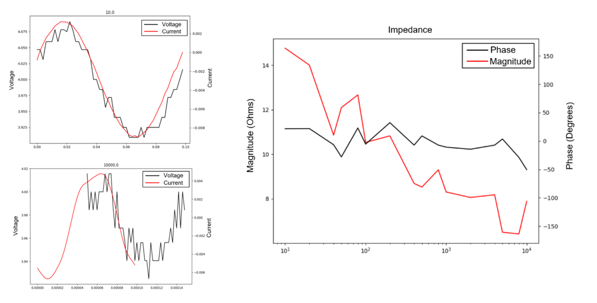

# Implementation of Energy Source and Battery Modeling

This document explains how the repository implements the **Energy Source: Battery** section of the co-design framework. The implementation is centered in `release/v0.0/src/battery.py`, and is supported by measurement datasets and EIS hardware support in `release/v0.0/batteries`.

---

## Primary Files and Data Sources

- `release/v0.0/src/battery.py` — electrochemical battery model and sizing functions.
- `release/v0.0/batteries/data/ss` — small signal EIS measurement outputs for battery cells.
- `release/v0.0/batteries/scripts/eis.py` — FPGA-based EIS test harness and command-line controller.
- `release/v0.0/batteries/xil` — FPGA interface sources for EIS measurement.
- `release/v0.0/batteries/data/capacity` — capacity measurements dataset.

---

## Battery Model Implementation (`release/v0.0/src/battery.py`)

`battery.py` defines a `Battery` class that captures layer-level material properties, cell mass, and capacity calculations.

### Chemistry and Materials

The model includes these active and passive materials:

- `CoO2`, `MnO2` — cathode chemistries
- `C` — carbon anode
- `Al`, `Cu` — current collectors
- `PP` — separator
- `Li` — lithium metal
- `Pouch` — packaging

Material data is encoded in class dictionaries:

- `specificCapacities`
- `densities`
- `thicknesses`

This matches the abstraction that battery energy and mass are computed from layer geometry and material density.

### Core Methods

- `bActive(chem)` — computes active cell mass and cathode mass for a single cell, using the layer thicknesses and densities.
- `bPackaging(brand)` — computes packaging mass for a pouch cell assuming a 1.2 mm × 1.2 mm footprint.
- `qPerGram(ccount, chem, brand)` — returns specific capacity per gram, including packaging mass for `ccount` stacked cells.
- `bMass(ccount, iavg, target, chem)` — estimates the runtime (seconds) for `ccount` cells delivering average current `iavg` and target capacity fraction `target`.
- `bRuntime(ccount, iavg, target, chem)` — returns the required battery mass to deliver the requested energy for a target runtime.
- `bMass2(ccounta, iavga, ccountb, iavgb, target, chem)` — computes a mixed-runtime estimate for two different cell-count/current combinations.

These functions implement the paper's Step 5 battery sizing logic: battery mass and runtime are derived from current draw, cell chemistry, and packaging overhead.

### Example Use

The script includes a small `main()` example that evaluates a runtime estimate for a 2-cell stack at 150 mA average draw and 100 mA target power.

---

## EIS and Small-Signal Battery Datasets

The release tree contains small-signal EIS data under `release/v0.0/batteries/data/ss`.

### Data Organization

- `battery.0/` and `battery.1/` contain CSV measurement data.
- Each directory includes both `sc_*` and `sv_*` interpreted data files.
- `summary.csv` contains the aggregated frequency sweep results with columns:
  - `frequency`
  - `magnitude`
  - `phase`

For example, `battery.0/summary.csv` lists frequency-dependent EIS results from 1 Hz to 10000 Hz guided by measurement strategies presented in Choi et al. (2022).

Example measurements are shown below:

  

### Measurement Role

This dataset provides real battery impedance and phase response information that can be used to validate battery selection, charge/discharge behavior, and the power electronics design.

---

## FPGA-Based EIS Instrumentation

The `release/v0.0/batteries/scripts/eis.py` script is a hardware driver for EIS measurement:

- it loads an FPGA bitstream using `xem.xem`
- it initializes the device and resets the controller
- it runs named measurement commands from the `programs` module

The `release/v0.0/batteries/xil` directory contains supporting FPGA sources:

- `eis.sv` — EIS measurement logic
- `spi.sv` — SPI interface

These artifacts show that the repository supports actual EIS hardware integration, not only offline modeling.

The `release/v0.0/batteries/pcb` directory contains the PCB specification files. The resulting implementation and usage is shown below:

  

---

## Relation to the Paper

In the co-design framework, battery sizing is the final step after actuator and converter design. The repository implements this by:

- modeling battery mass, capacity, and packaging in `release/v0.0/src/battery.py`
- providing real EIS measurement datasets in `release/v0.0/batteries/data/ss`
- including FPGA instrumentation for data capture and validation in `release/v0.0/batteries/scripts/eis.py`

Together, these artifacts bridge the paper's energy source section to the repository's actual data and code.
