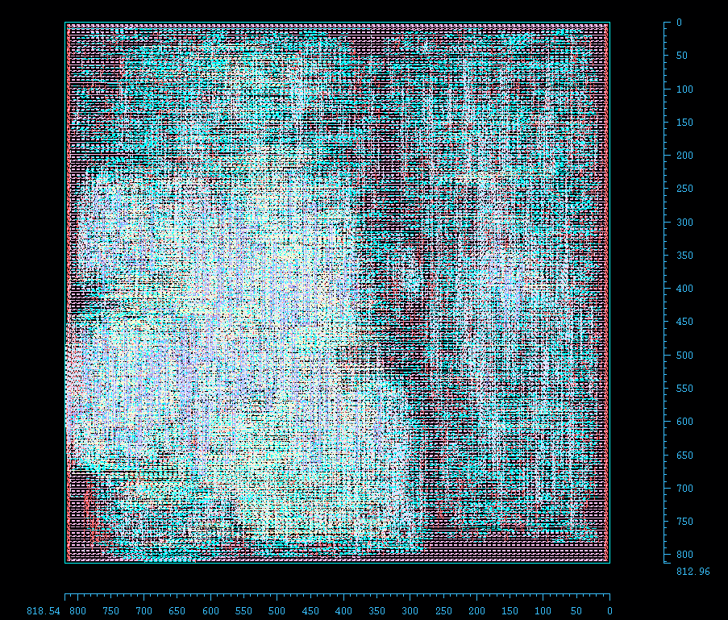
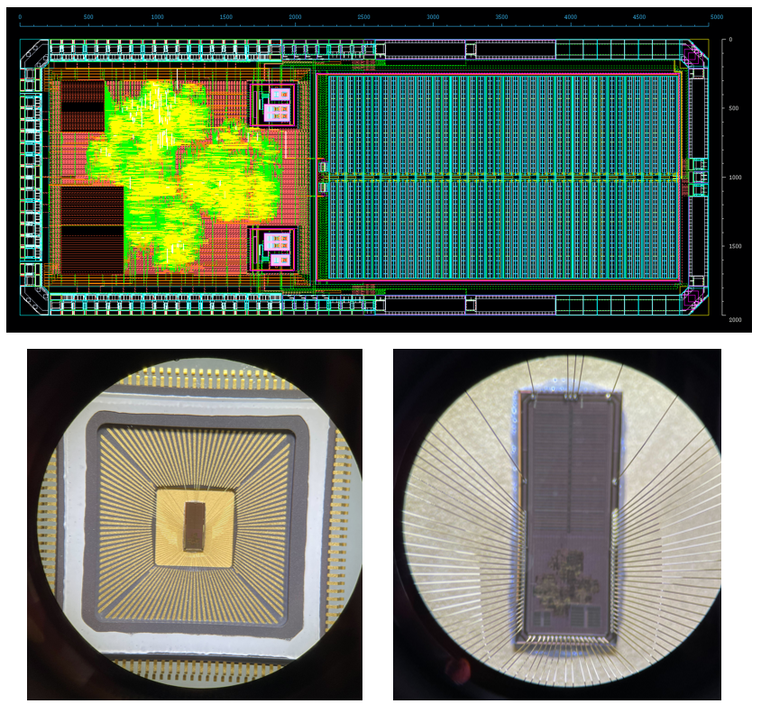
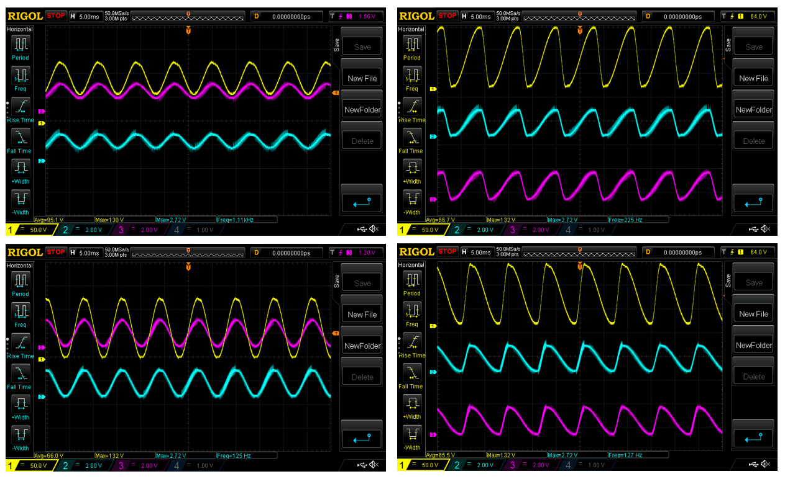

# Implementation of Controller Section

This document maps the paper's Controller / custom IC section to the actual hardware and support RTL in `fwmav-em-codesign/release/v0.0/electrical`.

---

## 1. Top-level ASIC integration (`release/v0.0/electrical/apr/netlist/Top.sv`)

`Top.sv` is the gate-level netlist central SoC, synthesized using Cadence Genus and Cadence Innovus:

- Instantiates the Cortex-M0 core (Core RTL sources are not included due to ARM IP requirements).
- Connects the core to a single AHB bus routing requests to memories and external/internal peripherals.
- Exposes two on-chip memories via AHB.
- Instantiates the key peripherals that implement the controller and power-electronics interfaces.

### Memory and peripheral map

The AHB interconnect address map in `Top.sv` shows the memory/peripheral layout used by the controller software:

- `M0` flash: base `0x0000_0000`, size `0x0001_0000` (64 KB)
- `M1` SRAM: base `0x2000_0000`, size `0x0000_8000` (32 KB)
- `M2` LED peripheral: base `0x4000_0000`, size `0x0000_1000`
- `M3` sercomm peripheral: base `0x4000_1000`, size `0x0000_1000`
- `M4` override peripheral: base `0x4000_2000`, size `0x0000_1000`
- `M6` boost converter peripheral: base `0x4000_4000`, size `0x0000_1000`
- `M7` charge-pump peripheral: base `0x4000_5000`, size `0x0000_1000`

These addresses directly map the controller software stack onto the ASIC's register and memory space.

---

## 2. Controller peripherals and custom ASIC logic

The controller section in the paper is realized as a set of AHB-attached peripherals and custom RTL.

### 2.1. Boost converter controller peripheral

- Exposes trigger/flag/register I/O for startup, ADC threshold, and clock dividers to enable external boost control.
- Uses an SPI-like interface to send comparator threshold values.
- Drives the boost switch output using dedicated positive and negative enable pins.
- Monitors the comparator input to pulse the boost drive output, periodically changing the effective boost frequency to match the desirec output voltage.

This is the digital controller that closes the loop on the boost converter and implements the comparator threshold / drive gating described in the paper.

### 2.2. Charge pump peripheral

- Provides the AHB register interface for the charge pump block.
- It instantiates `chargepump` module and exposes positive and negative clock output pins.

### 2.3. Actuation override / Drive interface

- Peripheral wrapper for the drive override hardware to control the on-chip HV AWG (or off-chip analog peripherals via FPGA during the design and test phases).
- Exposes:
  - SPI / serial control signals: `cs`, `mosi`, `sck`
  - Actuator driver output control: `pdrive`, `ndrive`, `drive_en`
  - Comparator input: `compare`
- This peripheral is the digital interface for actuator drive and comparator-based feedback.

### 2.4. Communications and status peripherals (for FPGA based Testing)

- UART/serial communication peripheral.
- Simple LED status peripheral. (Used in FPGA based debugging and testing)

These are standard controller support blocks for debug, telemetry, and status indication.

---

## 3. Physical implementation and tapeout evidence

The repository includes downstream physical and place-and-route artifacts that support the controller implementation:

- `release/v0.0/electrical/tapeout/` - Contains both the physical GDS and netlist associated with the 180 nm SOI tapeout used to validate on-chip power electronics

  

- `release/v0.0/electrical/apr/` - Contains both the physical GDS and netlist for the digital logic used in the analysis presented in the paper

  

These GDS files indicate that the controller ASIC design proceeds beyond RTL into layout/tapeout stages.

---

## 4. Process, mass, and power modeling for the controller ASIC

The ASIC controller's mass/power modeling is captured in:

- `release/v0.0/src/process_specs.py`
  - Models die mass with technology layer stacks for `XT018`, `XT011`, and `ASAP7`.
  - Computes memory power for `SPRAM18` and `SPRAM7` at operating frequency.
- `release/v0.0/static/external-xt018.csv`
  - Contains process/technology parameter rows used by the modeling flow.
- `release/v0.0/static/external-xt011.csv`
  - Equivalent process data for a similar 0.11 µm process.
- `release/v0.0/static/external-n65.csv`
  - External component / process parameters for another technology point (TSMC N65).

This matches the paper's Controller section where chip mass, process technology, and memory power are combined into the overall SWaP tradeoff. Although only 180 nm data is used in the paper (due to validation limitations), other process technologies to chip architectures can be included in this analysis by performing the same synthesis and workload characterization

---

## Part (c): Controller Test Implementation (`release/v0.0/control/cpp`)

The repository includes a C++ controller test harness under `release/v0.0/control/cpp` that implements and validates the high-level controller logic used to test the digital core before—or alongside—ASIC integration.

### Main simulation flow

- `Main.cpp` is the primary driver: it calls `InitModel()` then repeatedly invokes `SAMPLE_MODEL()` to exercise the control loop for benchmarking.
- `MainSim.cpp` and `MainTest.cpp` provide simulation and test entry points that run the same model with different IO backends.

### Core controller model

- `Unified.cpp` holds the controller implementation and configuration loader. `InitModel()` reads parameters from ASCII configuration files (e.g., `Config.txt`, `Config_100.txt`).
- The model stores tuning parameters, adaptive gains, limits, control gains, trajectory references, and actuator setpoint generation in a central `Config` structure.

### Test and communication support

- `Comm.h` defines the `Read<T>()` template used throughout the model to obtain inputs; `CommDummy.cpp` and `CommTest.cpp` provide test I/O implementations.
- The harness includes simple utilities and configuration files used to replay inputs and validate outputs from live hover tests captured using a Vicon Camera System (`Input.txt`, `Config_*.txt`, `Out.txt`).
- We leverage Hardware-In-The-Loop simulation and experimentation strategies using real flight data to determine whether our systems meet power and control requirements (Naveen et al. 2026)

### How this maps to the ASIC controller

This C++ test implementation is a software reference for the controller behavior that the ASIC implements in RTL (the AHB peripherals and FPU). It documents and validates:

- attitude and adaptive control loops;
- trajectory generation and desired-state computations;
- actuator command synthesis (the `BiasD2A`, `LeftD2A`, `RightD2A` outputs);
- test-driven validation used during RTL/HLS development and before tapeout.

Adding this section links the power-electronics models and ASIC RTL to the higher-level controller testbed used during development and validation.

### Part (d): Validation

Post-tapeout validation was executed to determine the on-chip voltage generation, AWG capabilities, and controller execution by combining:

- A 5 mm by 2 mm SOC in XFAB's X018 180 nm SOI CMOS process incorporating a 40 Stage Hybrid Charge Pump using ~22 pF capacitors per stage, 6 kB total on-chip SRAM, and the ARM Cortex M0 core and peripherals described above to highlight on-chip HV AWG
- An Arty A7 100-T FPGA to support live code execution (circumventing limited on-chip SRAM by levering FPGA Block RAM)
- A custom HV PCB implementing a similar 40 Stage Charge Pump Topology, but allowing interchangeable capacitances and variable input voltages
  -  Board files are included in `fwmav-em-codesign/release/v0.0/electrical/pcb`
- A sample 1 mm PZT Bimorph Actuator used as a load

Sample demos are included below:

https://github.com/user-attachments/assets/a99bc169-e8f9-4bd8-88ac-67e7b9119596

https://github.com/user-attachments/assets/5426e842-83e5-4379-abff-551bebb9a686

Sample oscilloscope measurements are posted below, data is included in `fwmav-em-codesign/release/v0.0/electrical/data/driver` and `fwmav-em-codesign/release/v0.0/electrical/data/cp`:

  

